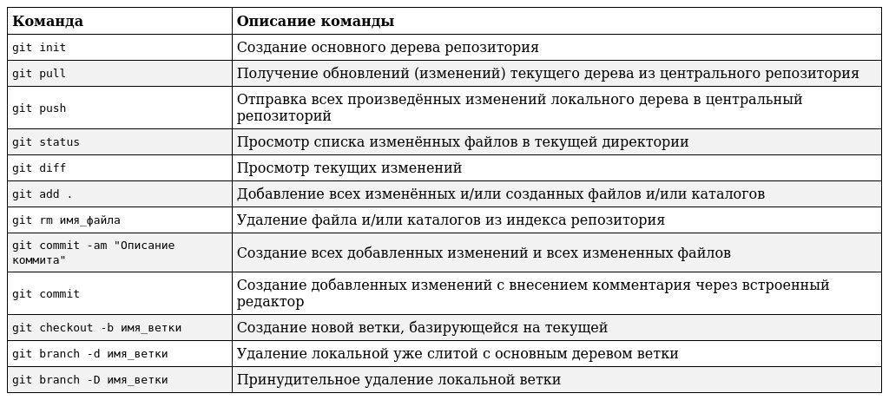

Welcome

## What is that?

- Система контроля версий — это система, записывающая изменения в файл или набор файлов в течение времени и позволяющая вернуться позже к определённой версии.

-  Она позволяет вернуть файлы к состоянию, в котором они были до изменений, вернуть проект к исходному состоянию, увидеть изменения, увидеть, кто последний менял что-то и вызвал проблему, кто поставил задачу и когда и многое другое. Использование VCS также значит в целом, что, если вы сломали что-то или потеряли файлы, вы спокойно можете всё исправить. В дополнение ко всему вы получите всё это без каких-либо дополнительных усилий.

## Основные команды git

Описание некоторых команд системы контороля версий Git

